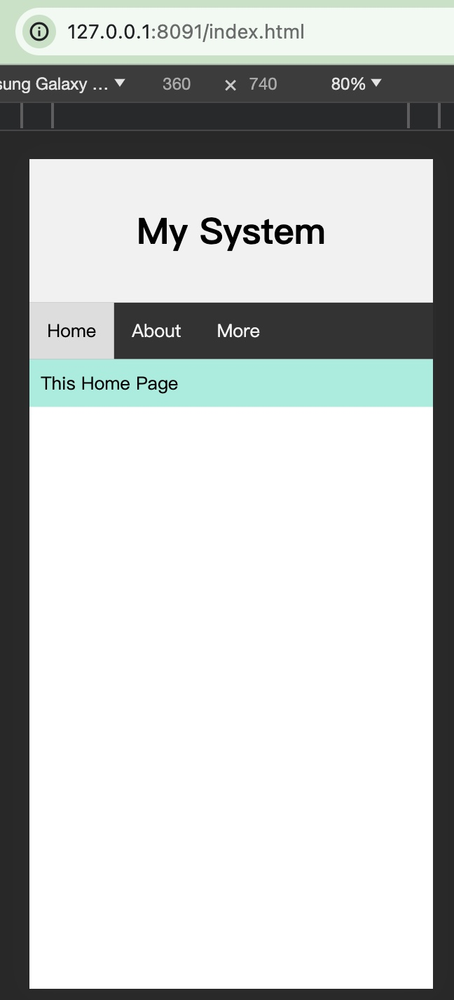
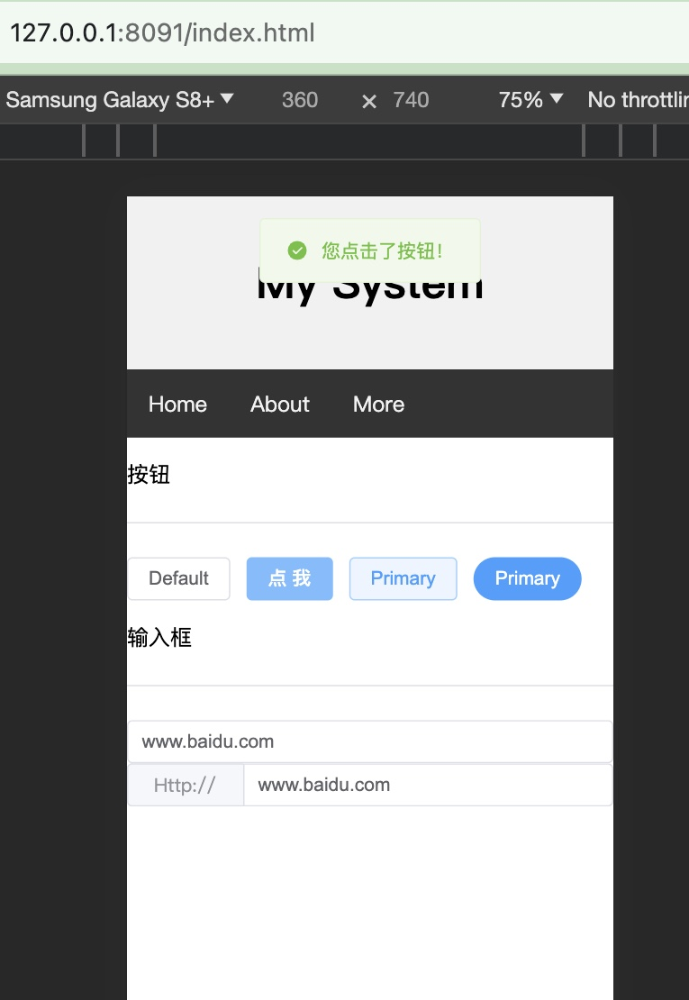

# vue3-rtf
我们一开始学Vue3的时候，困难会一下子升级几个Level，特别是我们这些老后端，喜欢后端输出一部分的html，然后结合前端js进行渲染。但万万没想到，过了短短几年，这种渲染跟不上时代了，当我们决心要一探Vue3究竟时，发现很多陌生的东西

- Vite？？？
- Webpack？？？
- Nuxt？？？
- npm！cnpm！yarn！！！！

我们只是想，能否只是写一个简单的html，然后显示我们想要的东西

而且，而且最难受的是，我们还得装nodejs，这个比火狐还版本。本来就是个老后端，本来就是想写个html开箱即用，vue2还可以凑合用用，但是vue3跨度就有点大了，起码对于我们这些老后端来说，那如果写个前端还得靠nodejs运行编译跑起来，那我们写的.Net,Java,PHP情何以堪，那还不如全部一套用JavaScript或者TypeScript，当然好像也有nodejs框架这么玩了，就是Nuxt，他可甜可咸，玩纯前端也行。玩前后端一起也行。哎！！！

写此项目的目的就是为了老后端熟悉前端运行原理，正式的环境应该还是得老老实实写前端代码，然后使用nodejs编译运行，发布。因为Vue3本来就是为了按需加载，为了快，为了更高的扩展才升级的，现在有点本末倒置，一点击浏览会加载一堆js。所以速度肯定没正儿八经的前端快，而且会在异步渲染vue模版消耗一些性能，所以只能用作即开箱玩的小项目，熟悉Vue3的底层运作。

此项目参考了[vue3-in-html](https://github.com/0611163/vue3-in-html) 作者的代码使用地图，我想对代码进行精简，更简单易懂。

引入 Element Plus 组件

## Roadmap

1. 简单支持Vue3 【已完成】
2. 支持 element-plus 组件 【已完成】
3. 支持更多Vue3特性
4. 升级到最新版本的Vue3和Element Plus 【已完成】 

## 特色

1. 原生 html 开发，不依赖 nodejs 和 webpack，不依赖脚手架
2. 支持在浏览器中直接运行.vue扩展名的组件文件
3. style 支持 scoped
4. vue 和 jqeury 混合使用，方便以较小的修改量引入旧代码

    

## 说明

1. 组件style支持scoped，但实现原理和vue的scoped不同，缺陷是父组件中的样式可能会应用到子组件中具有相同class的标签上，
   出现这种情况时要为子组件受影响的css属性在class中设置一下该属性的值

2. 支持.vue扩展名的文件，从而使编写的vue模板代码在vscode中具有语法检查

3. 谷歌浏览器可以打开，火狐浏览器未测试，不支持IE浏览器

